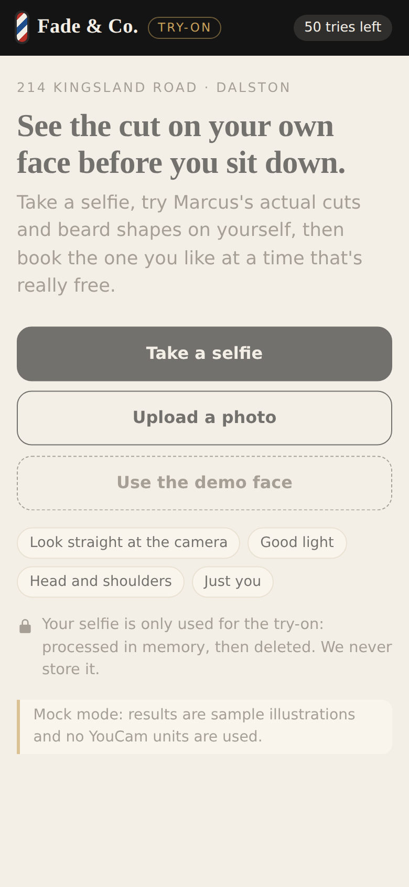
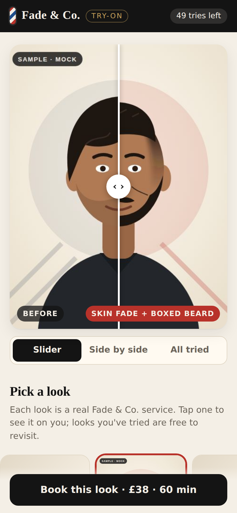
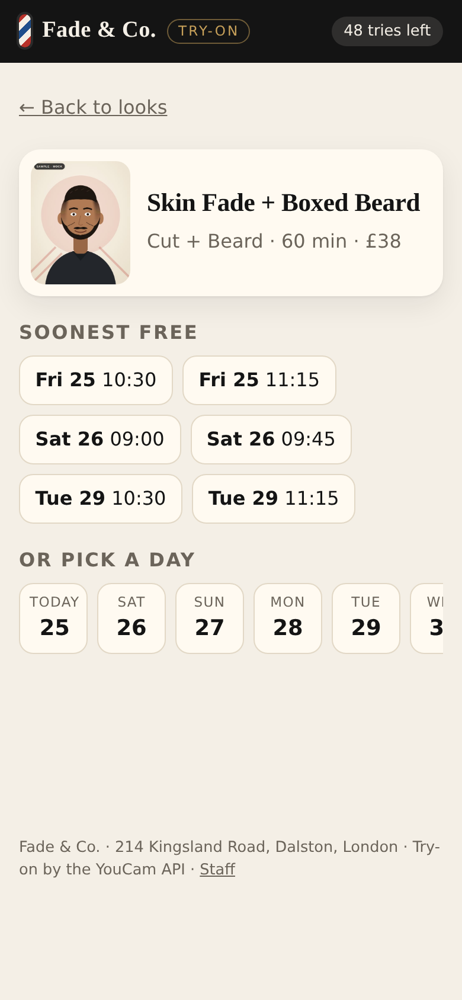
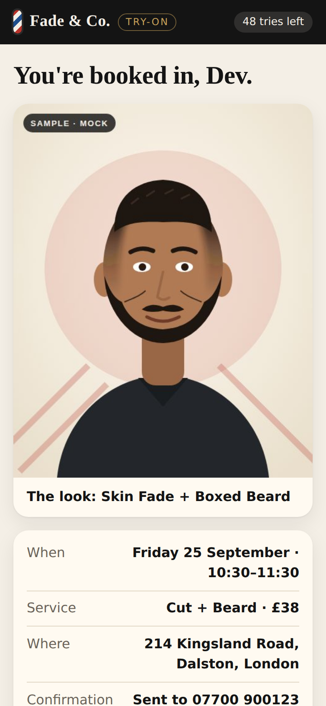
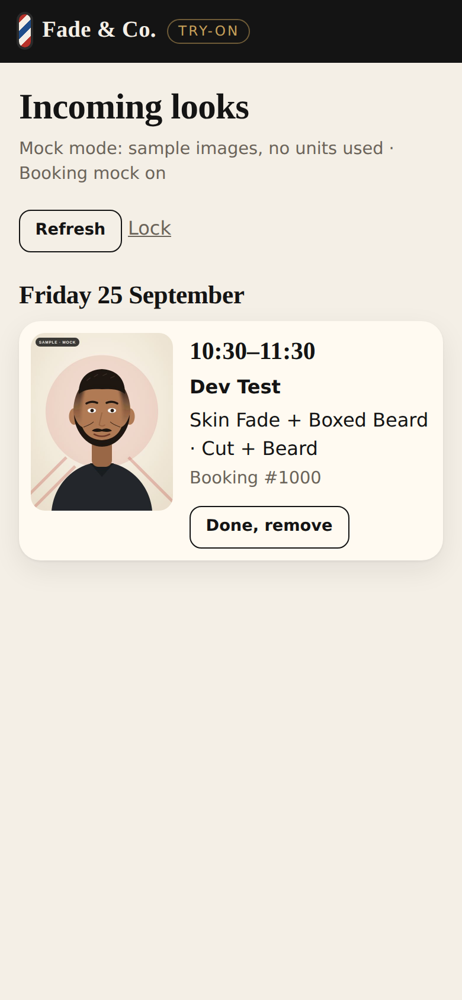
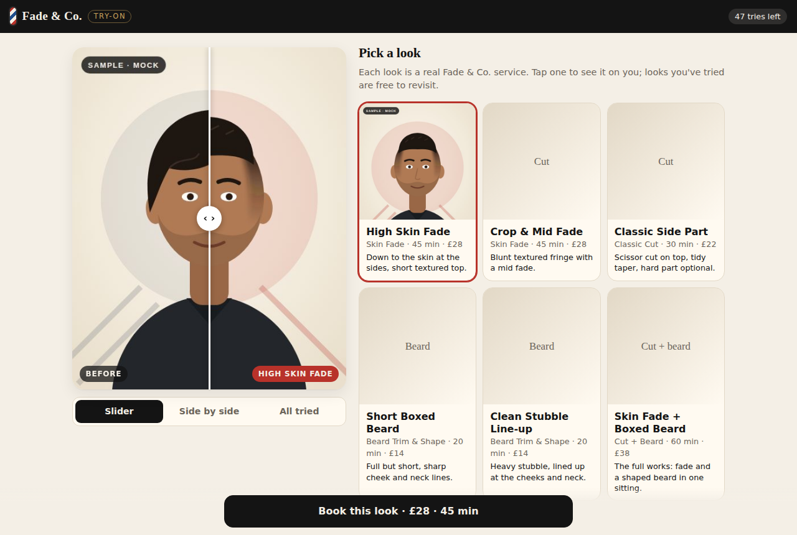
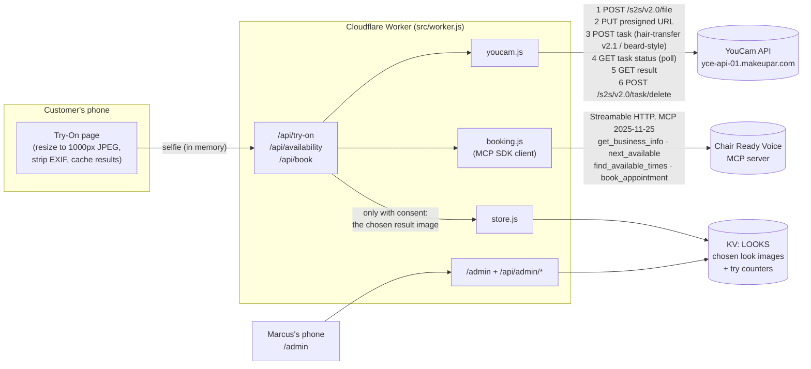
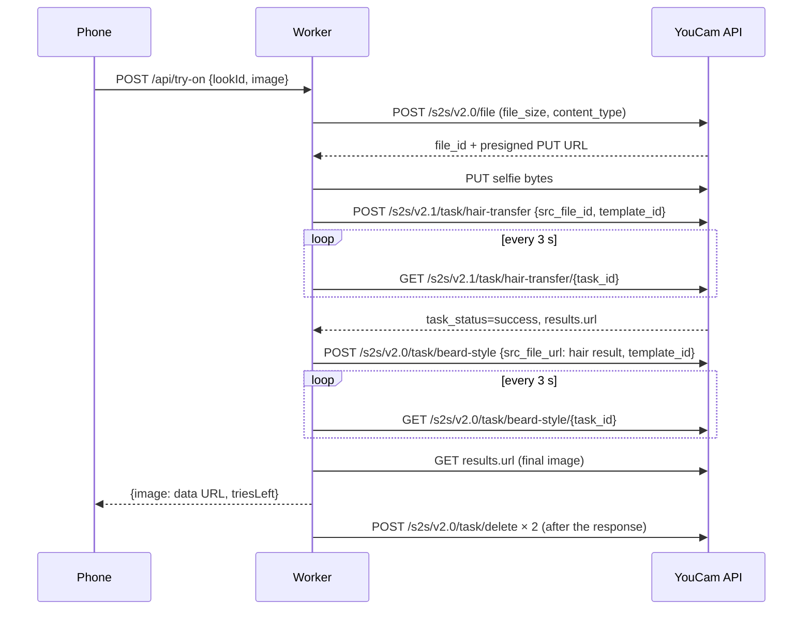

# Fade & Co. Try-On

See the cut on your own face before you book it.

Fade & Co. is a one-chair barbershop at 214 Kingsland Road, Dalston. Marcus works alone, and a lot of his day goes on the same conversation: "shorter on the sides… no, not like that", or a customer scrolling through someone else's photos. Try-On lets the customer:

1. take or upload a selfie on their phone,
2. try Fade & Co.'s real services on their own face (hairstyle and beard, via the [YouCam API](https://docs.perfectcorp.com)),
3. compare looks with a before/after slider, side by side, or all at once,
4. book the look they picked at a time that's actually free, through the shop's Chair Ready Voice MCP booking server,
5. and, if they tick the box, send that one result image to Marcus so he sees it before they sit down.

Built for the YouCam API Skin AI & eCommerce VTO Hackathon (Devpost). Write-up: [docs/DEVPOST.md](docs/DEVPOST.md) · demo script: [docs/VIDEO-SCRIPT.md](docs/VIDEO-SCRIPT.md) · API details: [docs/API-NOTES.md](docs/API-NOTES.md).

## Screenshots

These were taken in MOCK mode, so the faces are the bundled sample illustrations (marked "SAMPLE · MOCK").

| Start | Try a look | Pick a time |
|---|---|---|
|  |  |  |

| Booked | Marcus's incoming looks | Desktop |
|---|---|---|
|  |  |  |

### Real YouCam results

Every look, run through the live YouCam API with the pinned templates. The selfie is an AI-generated face (FLUX), not a real person.


## The looks

Each look is a real Fade & Co. service. Prices and durations come live from the booking server (`get_business_info`), with this list as the fallback.

| Look | Service | Time | Price | YouCam features | Units |
|---|---|---|---|---|---|
| Tapered Fade | Skin Fade | 45 min | £28 | hairstyle | 2 |
| Textured Crop | Skin Fade | 45 min | £28 | hairstyle | 2 |
| Side-Swept Undercut | Classic Cut | 30 min | £22 | hairstyle | 2 |
| Anchor Beard | Beard Trim & Shape | 20 min | £14 | beard | 2 |
| Goatee | Beard Trim & Shape | 20 min | £14 | beard | 2 |
| Tapered Fade + Anchor Beard | Cut + Beard | 60 min | £38 | hairstyle, then beard on the result | 4 |
| Buzz Cut | Classic Cut | 30 min | £22 | hairstyle | 2 |

The looks live in [`src/looks.js`](src/looks.js). Each hairstyle step can use:

- **Marcus's own work as the reference** (`LOOK_REFS`): a photo of a cut he's actually done is sent as `ref_file_url`, so the customer tries *his* skin fade, not a stock one;
- **a pinned YouCam template** (`LOOK_TEMPLATES`);
- or, by default, the YouCam template id pinned in `src/looks.js`, chosen from the live catalogue (`/api/admin/templates` lists it). Keyword matching is only a fallback if a pinned id is ever withdrawn.

There's deliberately no kids look: the shop still books kids' cuts, but the try-on never asks for a photo of a child.

## Architecture



Try-on sequence for "Tapered Fade + Anchor Beard":



Files:

| File | What it does |
|---|---|
| `src/worker.js` | Router and handlers |
| `src/youcam.js` | YouCam client and MOCK client |
| `src/looks.js` | Looks, services, look→service mapping, template/reference plan |
| `src/booking.js` | MCP booking client (official SDK) and an optional in-memory diary |
| `src/store.js` | Chosen looks in KV, per-visitor try cap |
| `src/page.js`, `src/client.js` | The two pages (inline HTML/CSS; browser code is serialised into a nonce'd script) |
| `src/mock-images.js` | Generated sample images (`npm run mock-images`) |

## Run it locally (MOCK mode, no key, no units)

Needs Node 20+.

```sh
npm install
cp .dev.vars.example .dev.vars   # YOUCAM_MOCK=1, BOOKING_MOCK=1, an ADMIN_TOKEN
npm run dev                      # wrangler dev, http://localhost:8787
```

- Open http://localhost:8787, press **Use the demo face**, try looks, book one.
- Open http://localhost:8787/admin and enter the `ADMIN_TOKEN` to see the incoming look.
- With `BOOKING_MOCK=0` the app talks to the real Chair Ready Voice server, so bookings there are real (demo) bookings.

Tests (no credentials, no network):

```sh
npm test
```

They cover the YouCam client against a fake API that follows the documented request and response shapes, the look→service mapping, and the booking flow against a mocked MCP server built with the SDK's own server classes.

## Deploy (owner only)

```sh
npx wrangler kv namespace create LOOKS           # paste the id into wrangler.toml
npx wrangler kv namespace create LOOKS --preview # paste the preview_id
npx wrangler secret put YOUCAM_API_KEY           # from the YouCam API console
npx wrangler secret put ADMIN_TOKEN              # long random string
# in wrangler.toml set YOUCAM_MOCK = "0" when you're ready to spend units
npx wrangler deploy
```

Settings (`[vars]` in `wrangler.toml`):

| Name | Default | Meaning |
|---|---|---|
| `YOUCAM_MOCK` | `"1"` | `1` = bundled samples, no YouCam calls |
| `BOOKING_MOCK` | `"0"` | `1` = in-memory diary instead of the MCP server |
| `BOOKING_MCP_URL` | Chair Ready Voice URL | MCP endpoint |
| `TRY_LIMIT` | `"8"` | Free try-ons per visitor per day |
| `LOOK_REFS` | unset | JSON `{lookId: url}`: Marcus's own photos as hairstyle references |
| `LOOK_TEMPLATES` | unset | JSON `{lookId: id}` or `{lookId: {hair, beard}}`: pinned template ids |
| `YOUCAM_API_KEY` | secret | YouCam API key |
| `ADMIN_TOKEN` | secret | Token for `/admin` |
| `VISITOR_SALT` | secret, optional | Salt for the visitor hash |

`npm run build:check` bundles the Worker with `wrangler deploy --dry-run` without uploading anything.

## Keeping YouCam usage small

- Results are cached in the browser per (photo hash, look), so going back to a look you've tried is free (and survives a reload if you pick the same photo again).
- Each visitor gets `TRY_LIMIT` try-ons a day (counted only when a try-on succeeds). The count is kept in KV under a hash of IP + browser, never the raw IP.
- The page resizes photos to 1000px JPEG before upload, which fits both the hairstyle (≤ 1024px) and beard (< 1024px) limits and keeps uploads small.
- "Cut + Beard" uploads the selfie once and runs the beard step on the hairstyle result URL.
- The template list is fetched once per Worker instance (listing costs no units).
- Where a hairstyle template allows it (`keep_users_color`), the Worker asks for the customer's own hair colour (`hair_color: "src"`), so a cut preview doesn't come with a surprise dye job.
- Errors are specific: no face, head turned, hair too short, out of units, and so on, each with something the customer can do about it.

## Privacy

- **The selfie is never stored by us.** It's resized on the phone (which also drops EXIF and GPS), sent to the Worker, held in memory for the request, uploaded to YouCam for processing, and then the YouCam task is deleted with `POST /s2s/v2.0/task/delete`, which removes the input and output files. Without that call YouCam deletes them after 30 days.
- **Only the chosen result image is kept, and only with consent.** If the customer ticks "Send this look to Marcus", that one generated image goes into KV with the booking time, their name and the look name (not their phone number). It expires a week after the appointment, and Marcus can remove it sooner with "Done".
- Without consent we store a text-only note (look name + booking) so Marcus knows what was asked for.
- Tried looks stay in the phone's `sessionStorage` until the tab is closed.
- The page sends no third-party scripts, fonts or trackers, and has a strict Content Security Policy.

## Licence

MIT, see [LICENSE](LICENSE).
