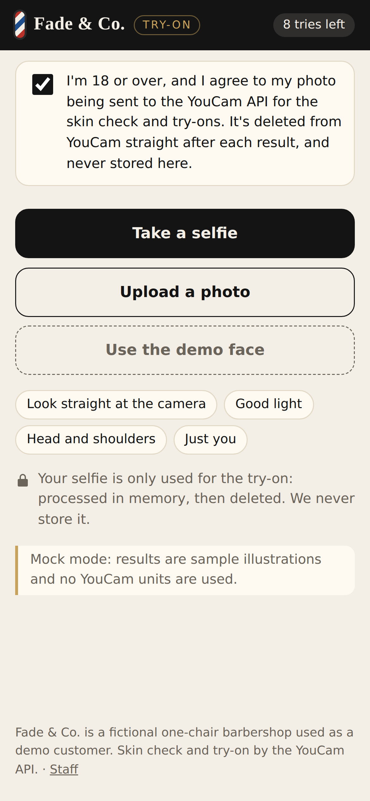
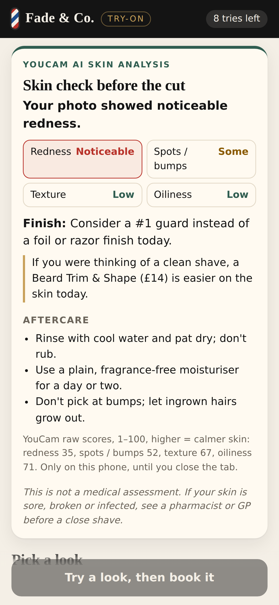
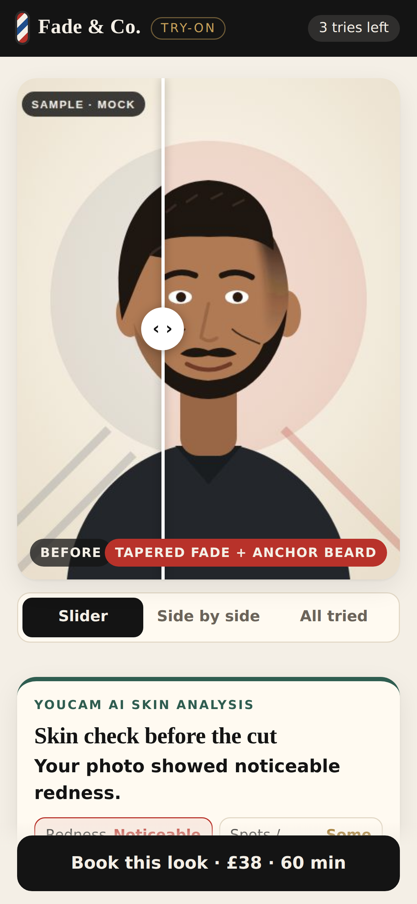
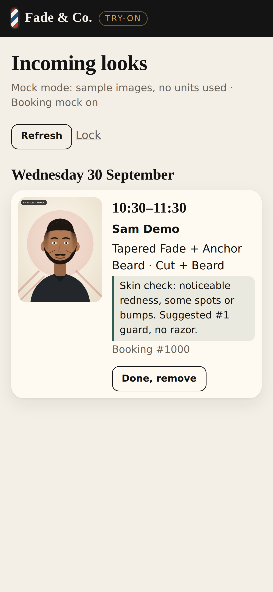
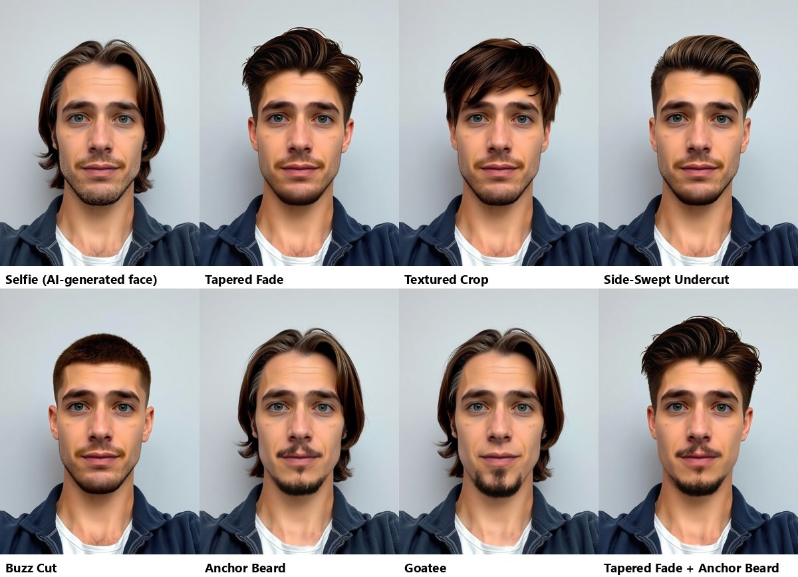
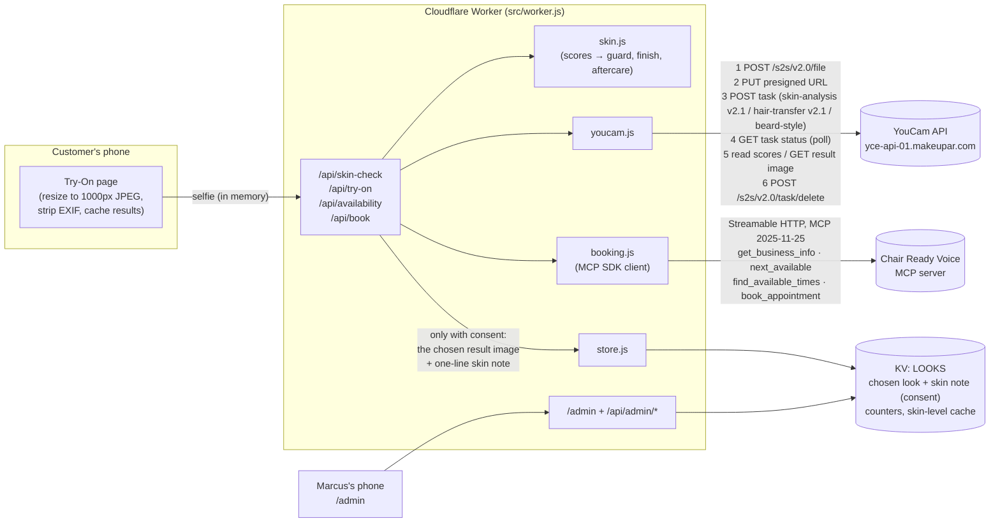
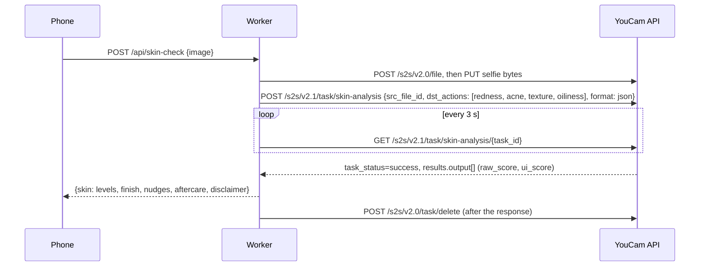
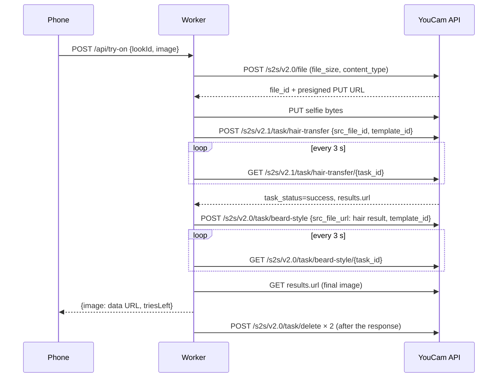

# Fade & Co. Try-On

A skin check before the cut, then see the cut on your own face and book it.

> **Fade & Co. is a fictional one-chair barbershop** we use as the demo customer, shared with our Chair Ready Voice project. "Marcus", the barber, is fictional too. The faces in the screenshots and video are drawn illustrations (MOCK mode) or an AI-generated face (FLUX), never a real person.

Close cuts are hard on skin: razor bumps (*pseudofolliculitis barbae*) are linked to close shaving and are more likely with curly or coarse hair ([DermNet](https://dermnetnz.org/topics/pseudofolliculitis-barbae), [NHS](https://www.nhs.uk/conditions/ingrown-hairs/)). Whether to finish with a foil, a razor or a guard is usually decided by eye in the chair. Try-On lets the customer:

1. agree to how their photo is used, then take one selfie on their phone,
2. run a **skin check** with [YouCam AI Skin Analysis](https://docs.perfectcorp.com/reference/ai_skin_analysis) (redness, bumps, texture, oiliness), which suggests a guard or finish, a gentler service and generic aftercare, with a clear "not a medical assessment" line,
3. try the shop's services on their own face (YouCam AI Hairstyle Generator v2.1 and AI Beard Style Generator),
4. compare looks with a before/after slider, side by side, or all at once,
5. book the look at a time that's actually free, through the Chair Ready Voice MCP booking server,
6. and, if they tick the box, send that look plus a one-line skin note ("noticeable redness, suggested #1 guard, no razor") to the barber before they sit down.

Built for the YouCam API Skin AI & Apparel VTO Hackathon (Devpost). The hackathon requires a YouCam API from the Skin or Fashion category: that's AI Skin Analysis here, since hair and beard are in the docs' *Hair & Beard* category (details in [docs/API-NOTES.md](docs/API-NOTES.md#which-category-do-our-apis-fall-under)).

Write-up: [docs/DEVPOST.md](docs/DEVPOST.md) · screenshots: [docs/SCREENSHOTS.md](docs/SCREENSHOTS.md) · video script: [docs/VIDEO-SCRIPT.md](docs/VIDEO-SCRIPT.md) · API details: [docs/API-NOTES.md](docs/API-NOTES.md).

## Screenshots

iPhone 14 size, taken in MOCK mode with `npm run screens`, so the faces are the bundled sample illustrations (marked "SAMPLE · MOCK"). All 14 are listed in [docs/SCREENSHOTS.md](docs/SCREENSHOTS.md).

| Consent | Skin check | Try a look | Incoming looks |
|---|---|---|---|
|  |  |  |  |

### Real YouCam results

Every look, run through the live YouCam API with the pinned templates. The selfie is an AI-generated face (FLUX), not a real person. `docs/samples/flux-selfie.jpg` and `flux-closeup.jpg` are crops of that same face, used by the screenshot and video scripts in live mode.



## The skin check

| Concern (SD) | What the card says | What it changes |
|---|---|---|
| `redness`, `acne` | Low / Some / Noticeable | Guard and finish: noticeable → "Consider a #1 guard instead of a foil or razor finish"; some → #0.5, no razor. A Beard Trim & Shape instead of a clean shave. |
| `texture` | Low / Some / Noticeable | Shown, and in Marcus's note |
| `oiliness` | Low / Some / Noticeable | Aftercare tip only |

- **One photo.** The same resized selfie is sent for the skin check and every look. If YouCam says the face is too small for skin analysis (it wants the face wider than 60% of the photo), the card offers a close-up just for the skin check.
- **Scores.** Levels come from YouCam's `raw_score` (1–100, higher = healthier): under 40 noticeable, 40–59.99 some, 60+ low. These cut-offs are ours, not YouCam's or clinical. See [`src/skin.js`](src/skin.js) and the TODOs in API-NOTES.
- **Cost.** 4 SD concerns = 9 units per check. A repeat check on the same photo is free (browser cache, plus a 6-hour Worker cache of the levels by photo hash). Failed checks cost nothing.
- **Wording.** Plain, cautious, non-medical: no brands, no products, and every result says "This is not a medical assessment." A *Low* result still says a camera can miss irritation, especially on darker skin.

## The looks

Each look is a real Fade & Co. service. Prices and durations come live from the booking server (`get_business_info`), with this list as the fallback.

| Look | Service | Time | Price | YouCam features | Units |
|---|---|---|---|---|---|
| Tapered Fade | Skin Fade | 45 min | £28 | hairstyle | 2 |
| Textured Crop | Skin Fade | 45 min | £28 | hairstyle | 2 |
| Side-Swept Undercut | Classic Cut | 30 min | £22 | hairstyle | 2 |
| Anchor Beard | Beard Trim & Shape | 20 min | £14 | beard | 2 |
| Goatee | Beard Trim & Shape | 20 min | £14 | beard | 2 |
| Tapered Fade + Anchor Beard | Cut + Beard | 60 min | £38 | hairstyle, then beard on the result | 4 |
| Buzz Cut | Classic Cut | 30 min | £22 | hairstyle | 2 |

The looks live in [`src/looks.js`](src/looks.js). Each hairstyle step can use:

- **Marcus's own work as the reference** (`LOOK_REFS`): a photo of a cut he's actually done is sent as `ref_file_url`, so the customer tries *his* skin fade, not a stock one;
- **a pinned YouCam template** (`LOOK_TEMPLATES`);
- or, by default, the YouCam template id pinned in `src/looks.js`, chosen from the live catalogue (`/api/admin/templates` lists it). Keyword matching is only a fallback if a pinned id is ever withdrawn.

There's deliberately no kids look: the shop still books kids' cuts, but the try-on never asks for a photo of a child.

## Architecture



Skin check sequence:



Try-on sequence for "Tapered Fade + Anchor Beard":



Files:

| File | What it does |
|---|---|
| `src/worker.js` | Router and handlers |
| `src/youcam.js` | YouCam client (skin analysis, hairstyle, beard) and MOCK client |
| `src/skin.js` | Skin scores → levels → guard/finish, service nudges, aftercare, Marcus's note |
| `src/looks.js` | Looks, services, look→service mapping, template/reference plan |
| `src/booking.js` | MCP booking client (official SDK) and an optional in-memory diary |
| `src/store.js` | Chosen looks (and skin notes) in KV, usage counters |
| `src/page.js`, `src/client.js` | The two pages (inline HTML/CSS; browser code is serialised into a nonce'd script) |
| `src/mock-images.js` | Generated sample images (`npm run mock-images`) |
| `scripts/screens.mjs`, `scripts/demo-video.mjs` | Playwright: 14 phone screenshots, and the demo video |

## Run it locally (MOCK mode, no key, no units)

Needs Node 20+.

```sh
npm install
cp .dev.vars.example .dev.vars   # YOUCAM_MOCK=1, BOOKING_MOCK=1, an ADMIN_TOKEN
npm run dev                      # wrangler dev, http://localhost:8787
```

- Open http://localhost:8787, tick the photo consent box, press **Use the demo face**, run the skin check, try looks, book one.
- Open http://localhost:8787/admin and enter the `ADMIN_TOKEN` to see the incoming look.
- With `BOOKING_MOCK=0` the app talks to the real Chair Ready Voice server, so bookings there are real (demo) bookings.

Tests (no credentials, no network):

```sh
npm test
```

They cover the YouCam client (skin analysis, hairstyle, beard) against a fake API that follows the documented request and response shapes, the score→suggestion thresholds at every boundary, consent gating, "no charge on failure" and task deletion, the look→service mapping, and the booking flow against a mocked MCP server built with the SDK's own server classes.

Screenshots and the demo video (Playwright, Chromium):

```sh
npx playwright install chromium    # once
npm run screens                    # MOCK, against npm run dev
npm run video && npm run video:mp4 # out/fade-try-on-demo.webm -> .mp4 (needs ffmpeg)
```

Running them more than once a day locally? Start the dev server with `npx wrangler dev --var TRY_LIMIT:100 --var SKIN_LIMIT:20` so the per-visitor caps don't get in the way. Live runs are in [docs/SCREENSHOTS.md](docs/SCREENSHOTS.md) and [docs/VIDEO-SCRIPT.md](docs/VIDEO-SCRIPT.md).

## Deploy (owner only)

```sh
npx wrangler kv namespace create LOOKS           # paste the id into wrangler.toml
npx wrangler kv namespace create LOOKS --preview # paste the preview_id
npx wrangler secret put YOUCAM_API_KEY           # from the YouCam API console
npx wrangler secret put ADMIN_TOKEN              # long random string
# in wrangler.toml set YOUCAM_MOCK = "0" when you're ready to spend units
npx wrangler deploy
```

Settings (`[vars]` in `wrangler.toml`):

| Name | Default | Meaning |
|---|---|---|
| `YOUCAM_MOCK` | `"1"` | `1` = bundled samples, no YouCam calls |
| `BOOKING_MOCK` | `"0"` | `1` = in-memory diary instead of the MCP server |
| `BOOKING_MCP_URL` | Chair Ready Voice URL | MCP endpoint |
| `TRY_LIMIT` | `"8"` | Free try-ons per visitor per day |
| `SKIN_LIMIT` | `"2"` | Skin checks per visitor per day (9 units each) |
| `DAILY_TRY_LIMIT` | `"40"` | Try-ons for the whole site per UTC day |
| `DAILY_UNIT_LIMIT` | `"200"` | YouCam units for the whole site per UTC day (skin checks + try-ons) |
| `LOOK_REFS` | unset | JSON `{lookId: url}`: Marcus's own photos as hairstyle references |
| `LOOK_TEMPLATES` | unset | JSON `{lookId: id}` or `{lookId: {hair, beard}}`: pinned template ids |
| `YOUCAM_API_KEY` | secret | YouCam API key |
| `ADMIN_TOKEN` | secret | Token for `/admin` |
| `VISITOR_SALT` | secret, optional | Salt for the visitor hash |

`npm run build:check` bundles the Worker with `wrangler deploy --dry-run` without uploading anything.

## Keeping YouCam usage small

| Action | Units |
|---|---|
| Skin check (4 SD concerns) | 9 |
| Hairstyle or beard look | 2 |
| Cut + Beard look | 4 |
| Repeat of anything already done on this photo | 0 |
| Anything that fails | 0 counted against the visitor |

A typical visit (skin check + three looks, as in the demo) is 17 units; the most one visitor can use in a day is 2 × 9 + 8 × 4 = 50. The whole site stops at `DAILY_UNIT_LIMIT` (200 by default, about 11 typical visits). The maths is in [docs/API-NOTES.md](docs/API-NOTES.md#unit-budget).

- Results are cached in the browser per (photo hash, look), and skin levels per photo hash, so going back is free.
- Counters are only moved when a result comes back, and are kept in KV under a hash of IP + browser, never the raw IP.
- The page resizes photos to 1000px JPEG, which fits the hairstyle (≤ 1024px), beard (< 1024px) and skin analysis (short side ≥ 480px) limits.
- "Cut + Beard" runs the beard step on the hairstyle result URL.
- The template list is fetched once per Worker instance (listing costs no units).
- Errors are specific: no face, head turned, hair too short, face too small for the skin check, too dark, out of units, each with something the customer can do.

## Privacy

- **Consent first.** The photo buttons stay disabled until the customer ticks a box saying the photo goes to the YouCam API for the skin check and try-ons and is deleted afterwards.
- **The selfie is never stored by us.** It's resized on the phone (which also drops EXIF and GPS), sent to the Worker, held in memory for the request, uploaded to YouCam, and then the YouCam task is deleted with `POST /s2s/v2.0/task/delete`, which removes the input and output files. This happens for skin checks and try-ons, after success and after failure.
- **Raw skin scores are never stored.** The customer sees them once on the card. The Worker keeps only the derived levels (low / some / noticeable) for six hours, keyed by a hash of the photo, so a resend doesn't cost units again.
- **Only the chosen look and a one-line skin note are kept, and only with consent.** The same booking consent box covers both. The note is rebuilt on the server from the levels, and expires with the look, a week after the appointment. Marcus can remove it sooner with "Done". Phone numbers are never stored.
- Without consent we store a text-only note (look name + booking) and no skin information.
- Tried looks and the skin result stay in the phone's `sessionStorage` until the tab is closed.
- No third-party scripts, fonts or trackers, and a strict Content Security Policy.
- There's no kids look, and the consent box asks the customer to confirm they're 18 or over.

## Licence

MIT, see [LICENSE](LICENSE).
